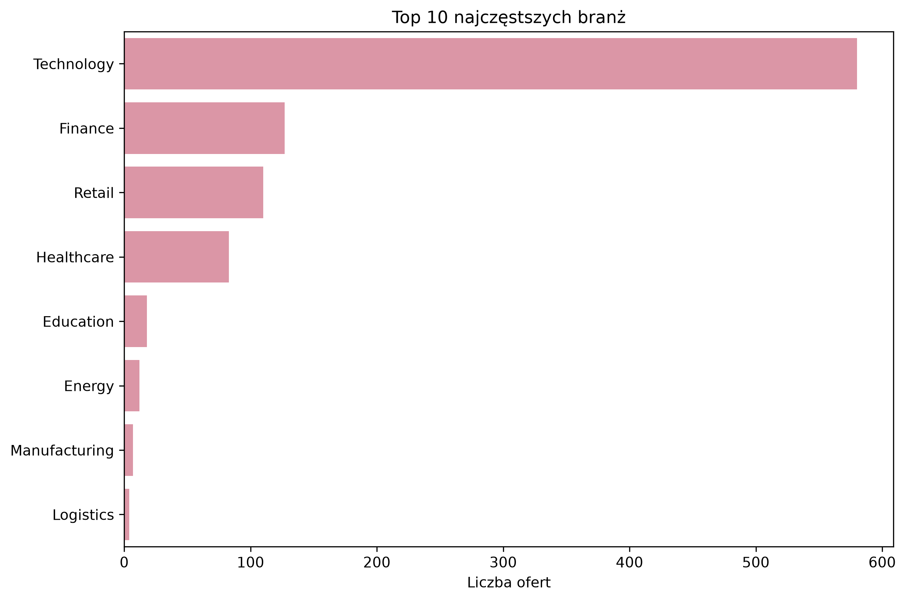
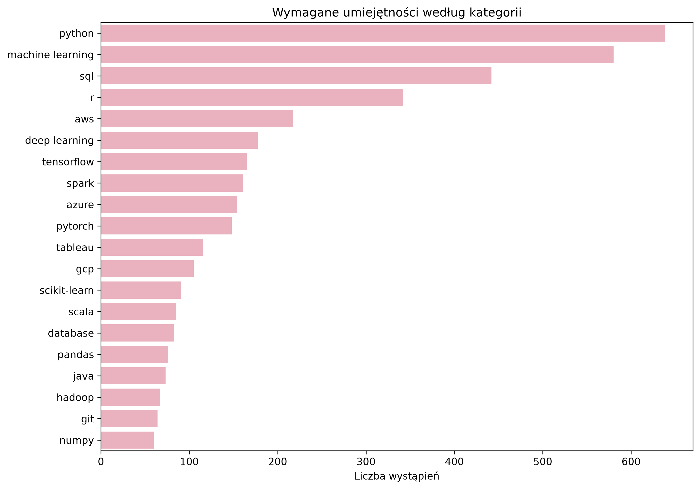
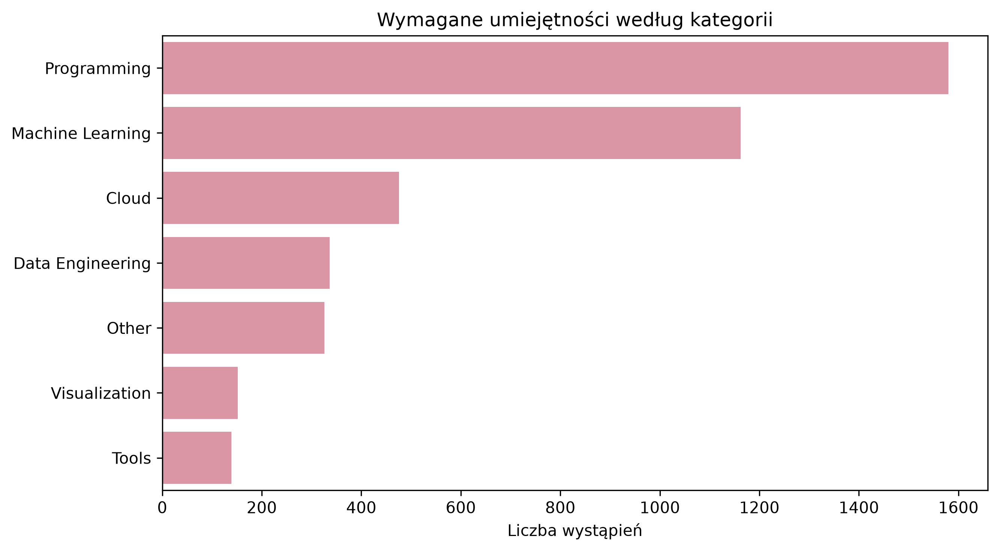
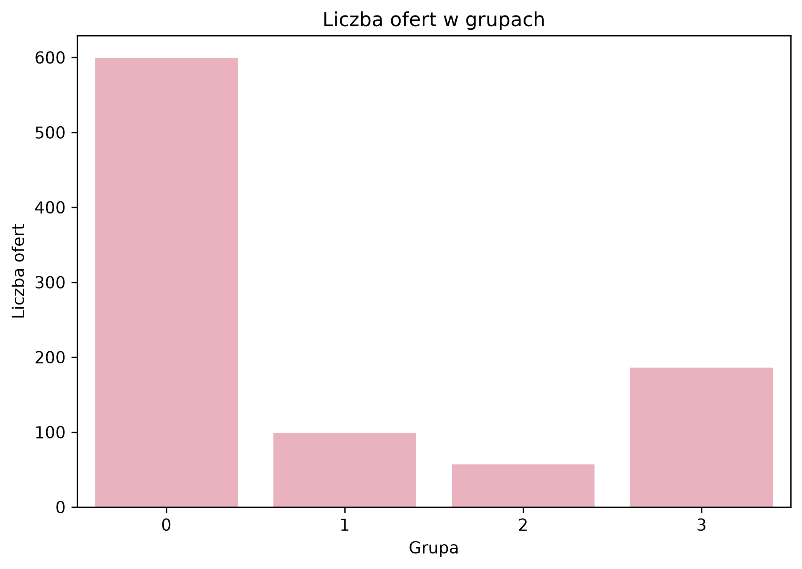
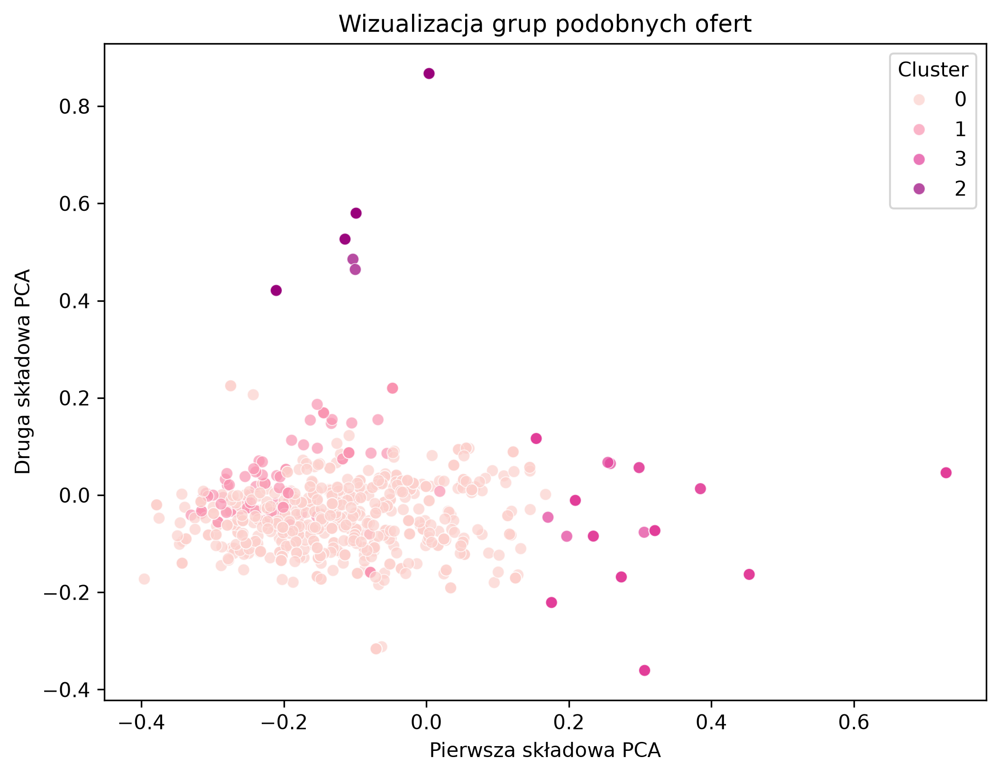

# Data Jobs Skills Analyzer

## Opis projektu

Celem projektu jest analiza ofert pracy z obszaru data science i pokrewnych stanowisk.

Projekt pokazuje, jakie umiejętności najczęściej pojawiają się w ofertach pracy, z jakich branż pochodzą oferty oraz które oferty najlepiej pasują do wybranego profilu umiejętności.

W projekcie wykorzystałam analizę tekstu, TF-IDF, grupowanie podobnych ofert oraz prosty system dopasowania ofert do umiejętności użytkownika.

Dodatkowo przygotowałam aplikację w Streamlit, która pozwala interaktywnie przeglądać wyniki analizy.

## Zbiór danych

Dane pochodzą z datasetu z ofertami pracy z obszaru data science.

Zbiór danych zawierał początkowo:

- 944 oferty pracy,
- 13 kolumn,
- informacje o stanowisku, firmie, lokalizacji, branży, wynagrodzeniu i wymaganych umiejętnościach.

Po czyszczeniu danych w projekcie zostało:

- 941 ofert pracy,
- 17 kolumn,
- 0 brakujących wartości.

Najważniejsze kolumny wykorzystane w projekcie:

- `job_title`
- `company`
- `location`
- `industry`
- `salary`
- `skills`

## Cel analizy

Celem projektu było:

- przygotowanie i oczyszczenie danych,
- analiza najczęstszych stanowisk i branż,
- sprawdzenie najczęściej wymaganych umiejętności,
- podział umiejętności na kategorie,
- zamiana tekstu ofert na reprezentację liczbową za pomocą TF-IDF,
- pogrupowanie podobnych ofert pracy,
- stworzenie prostego systemu dopasowania ofert do profilu użytkownika,
- przygotowanie aplikacji Streamlit do przeglądania wyników.

## Użyte technologie

W projekcie wykorzystałam:

- Python,
- pandas,
- numpy,
- matplotlib,
- seaborn,
- scikit-learn,
- joblib,
- Streamlit.

## Struktura projektu

W repozytorium znajdują się:

- `src/` – pliki z analizą danych i przetwarzaniem tekstu,
- `app/` – aplikacja Streamlit,
- `images/` – wybrane wykresy,
- `README.md` – opis projektu,
- `requirements.txt` – lista bibliotek

## Przygotowanie danych

W pierwszym kroku dane zostały wczytane i sprawdzone pod kątem brakujących wartości oraz duplikatów.

W danych występowały braki m.in. w kolumnach:

- `job_title`,
- `seniority_level`,
- `status`,
- `location`,
- `ownership`,
- `revenue`.

Wiersze bez nazwy stanowiska zostały usunięte, a pozostałe braki zostały uzupełnione wartością `Unknown`.

Kolumna `skills` została przekształcona z tekstowej listy na listę umiejętności. Na tej podstawie utworzyłam dodatkowe kolumny:

- `skills_list`,
- `skills_clean`,
- `skills_count`,
- `combined_text`.

Kolumna `combined_text` została później wykorzystana w części związanej z analizą tekstu.

## Eksploracyjna analiza danych

W analizie sprawdziłam m.in.:

- najczęstsze stanowiska,
- najczęstsze branże,
- liczbę umiejętności przypisaną do jednej oferty,
- najczęściej wymagane umiejętności.

Większość ofert w zbiorze dotyczy stanowiska `data scientist`, dlatego wyniki należy interpretować głównie w kontekście ofert data science.

### Najczęstsze branże

## Analiza umiejętności

Najczęściej pojawiające się umiejętności w ofertach to:

- `python`,
- `machine learning`,
- `sql`,
- `r`,
- `aws`,
- `deep learning`,
- `tensorflow`,
- `spark`,
- `azure`,
- `pytorch`.

Najczęściej wymaganą umiejętnością był `python`, który pojawił się w około 67.8% ofert.

### Top 20 najczęściej wymaganych umiejętności

## Kategorie umiejętności

Umiejętności zostały podzielone na kilka kategorii:

- Programming,
- Machine Learning,
- Cloud,
- Data Engineering,
- Visualization,
- Tools,
- Other.

Najczęściej pojawiały się umiejętności z kategorii:

- Programming,
- Machine Learning,
- Cloud,
- Data Engineering.

### Wymagane umiejętności według kategorii

## Analiza tekstu

Do analizy tekstu ofert wykorzystałam metodę **TF-IDF**.

TF-IDF pozwala zamienić tekst na liczby, dzięki czemu można później porównywać podobieństwo ofert pracy.

W projekcie tekst został przygotowany na podstawie kolumny `combined_text`, która łączyła informacje o stanowisku, poziomie seniority, branży i wymaganych umiejętnościach.

Po wektoryzacji powstała macierz TF-IDF o wymiarach **941 ofert x 413 cech tekstowych**.

## Grupowanie podobnych ofert

Oferty zostały pogrupowane na podstawie podobieństwa tekstowego.

Do grupowania wykorzystałam algorytm **KMeans**. Oferty zostały podzielone na 4 grupy.

Liczba ofert w grupach:

| Grupa | Liczba ofert |
|---|---:|
| 0 | 599 |
| 1 | 99 |
| 2 | 57 |
| 3 | 186 |

Jedna z grup zawierała głównie oferty bez podanych umiejętności, co pokazuje ograniczenie zbioru danych.

### Liczba ofert w grupach

### Wizualizacja grup ofert

## Dopasowanie ofert do profilu

W projekcie stworzyłam prosty system dopasowania ofert do profilu użytkownika.

Przykładowe umiejętności użytkownika:

- `python`
- `sql`
- `pandas`
- `numpy`
- `matplotlib`
- `seaborn`
- `scikit-learn`
- `machine learning`
- `r`
- `excel`

Dla każdej oferty został policzony `wynik dopasowania`, czyli procent wymaganych umiejętności z oferty, które znajdują się w profilu użytkownika.

Przykład: jeśli oferta wymaga 5 umiejętności, a użytkownik ma 4 z nich, to `wynik dopasowania` wynosi 80%.

Dla przykładowego profilu wyniki były następujące:

| Wynik                        | Wartość |
|------------------------------|---:|
| Średni wynik dopasowania     | 49.0% |
| Mediana wyniku dopasowania   | 50.0% |
| Maksymalny wynik dopasowania | 100.0% |

## Aplikacja Streamlit

Do projektu dodałam aplikację w Streamlit.

Aplikacja pozwala:

- zobaczyć podstawowe informacje o danych,
- sprawdzić najczęściej wymagane umiejętności,
- zobaczyć grupy podobnych ofert,
- wybrać własne umiejętności,
- sprawdzić najlepiej dopasowane oferty pracy.

Aplikacja ma cztery zakładki:

- Podsumowanie,
- Umiejętności,
- Grupy podobnych ofert,
- Dopasowanie ofert.

